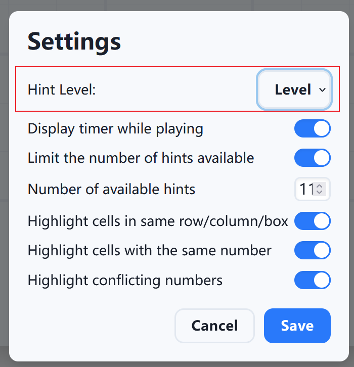
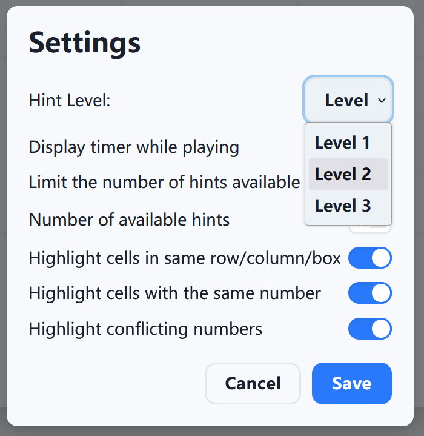
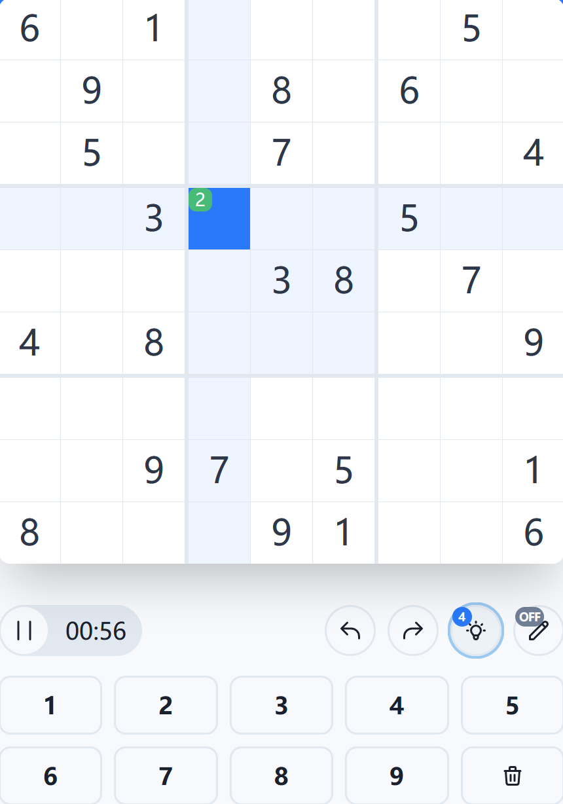
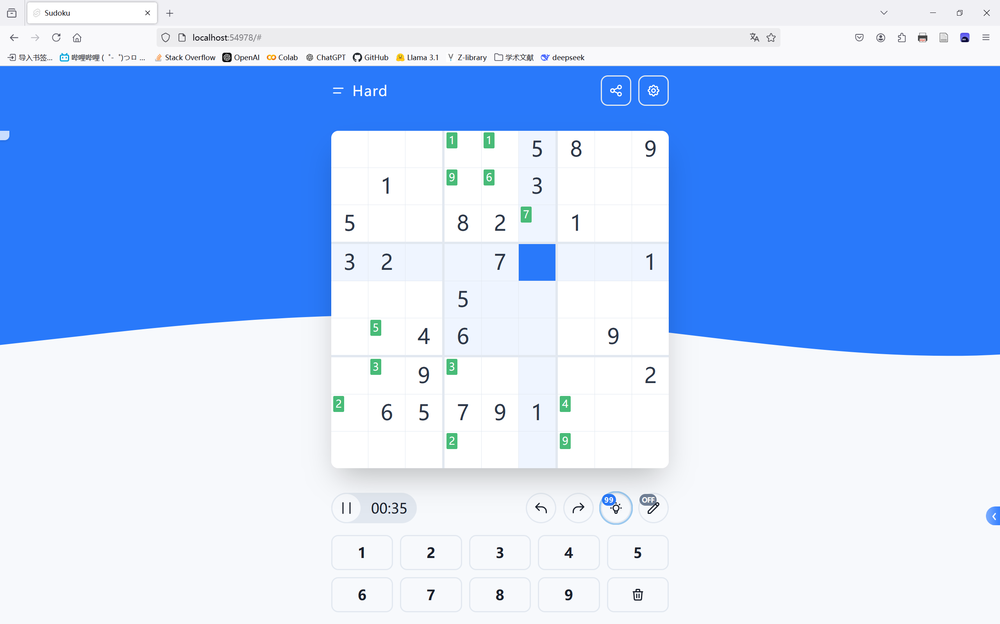
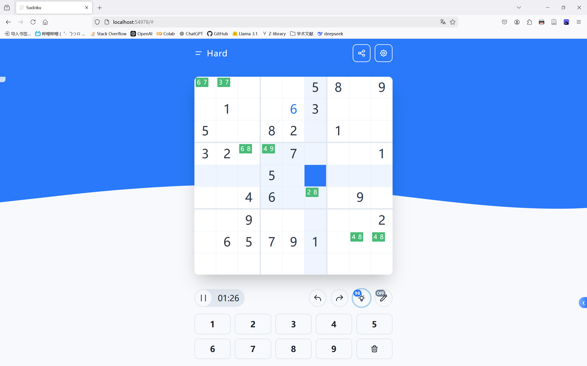
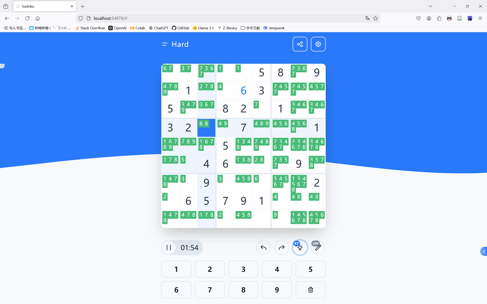

# 下一步提示实现具体说明

## 提示交互逻辑的修改

### 1. 设置项

在设置中加入 `hintLevel`​ 选项，备选值为 {1,2,3}，通过 `hintLevel`​ 指明通过提示按钮获得的提示等级，`hintLevel`​ 值可以通过设置按钮来修改。

修改涉及以下文件：

1. src/node\_modules/@sudoku/constants.js
2. src/components/Modal/Types/Settings.svelte

实现效果如下：

​​

​​

### 2. 提示的应用逻辑和显示效果

原项目的提示交互逻辑：

1. 前端展示：在操作栏中展示提示按钮，并根据提示次数的可用性控制按钮的状态。
2. 用户交互：用户点击提示按钮后，前端调用 handleHint 函数，触发提示逻辑。
3. 状态管理：hints store 管理提示次数，userGrid store 管理数独棋盘的状态。
4. 提示逻辑：调用 solveSudoku 方法求解数独，并将当前单元格的值设置为求解后的正确值。
5. 后端求解：使用 @mattflow/sudoku-solver 库进行数独求解，返回正确的数字。

将其修改为：

1. 用户点击提示按钮后，调用 handleHint 触发提示逻辑。
2. 求解数独，在当前单元格上显示求解后正确的值，但并不修改 userGrid 的状态。
3. 如果用户点击当前单元格，如果单元格上只有唯一候选值，则将当前单元格上的值填入 userGrid 中；如果单元格上有多个提示候选值，则不填入，由用户自己在键盘上输入数值填入。
4. 如果用户点击其他单元格，则不再显示当前单元格上的提示内容。

涉及修改的文件：

1. src/components/Board/Cell.svelte
2. src/components/Board/index.svelte
3. src/node_modules/@sudoku/stores/hintStore.js → 该项为新增
4. src/node_modules/@sudoku/stores/hints.js
5. src/node_modules/@sudoku/stores/grid.js

实现效果如下：

​​

​​

具体交互逻辑的说明：

1. 用户点击提示按钮，触发 Hints 类的 useHint 方法，通过和策略类交互，将当前棋盘状态送入策略类，策略类返回一个两个数组：第一个数组是通过调用策略得到的棋盘候选值，可以理解为一个 9×9 的二维数组，数组的元素也是数组：表示每个位置上的候选值列表，该列表长度就是候选值的数量；第二个数组是策略类返回的提示原因，也是一个 9×9 的二维数组，数组的元素是一个说明原因的列表。
2. Hints 类通过筛选得到的候选值列表的长度，将其分组到三个列表中：长度为1（仅一个候选值）的进 level_one_list，长度为2的进 level_two_list，长度<9的进 level_three_list，得到三个列表后根据设置中的 hintLevel 选项决定将哪个列表传递到 userGrid 类。
3. userGrid 类将 Hints 类传递过来的解数组存入 hintStore 中，hintStore 通过一个 writable 的 store 存储解数组，在前端 Cell.svelte 中对 hintStore 进行订阅。
4. 点击提示后，hintStore 中的状态发生改变，Cell.svelte 的前端展示部分会把新增的提示内容显示在对应的单元格上，如果点击提示，则将提示值填入 userGrid，同时清空 hintStore 的存储状态；如果点击其他没有提示的单元格，同样清空 hintStore 的存储状态。
5. 同时 Hints 类中得到的原因数组也会通过一个 writable 的 store 进行存储，在 Cell.svelte 中导入，如果点击提示的单元格上有相应的原因，则会在棋盘左侧显示原因的文字。

### 3. 与策略类的对接

解题策略相关的内容在 sudoku-main\src\node_modules\@sudoku\strategy 目录下。用法：

* strategyManager.js 是策略的管理类。
* 具体的导出类实例、注册策略：

  ```javascript
  export const strategymanager = new StrategyManager();

  // 注册策略
  strategymanager.register(lastRemianStrategy)
  strategymanager.register(nakePairStrategy); 
  strategymanager.register(hiddenPairStrategy);
  ```

实现效果如下：

​​

​​

​​

​​

## 其他说明

1. 代码中的 console.log 均为调试语句，可以删除。
2. 如果提示只有一个候选值，点击单元格会填入提示值；如果提示有多个候选值，点击单元格则提示内容消失，单元格的值由用户自行填入。

## 具体修改的代码（整个粘贴）

### src/node_modules/@sudoku/constants.js

```svelte
export const BASE_URL = 'https://sudoku.jonasgeiler.com/';

export const DIFFICULTY_CUSTOM = 'custom';
export const DIFFICULTIES = {
	veryeasy: 'Very Easy',
	easy:     'Easy',
	medium:   'Medium',
	hard:     'Hard',
};

export const DEFAULT_SETTINGS = {
	darkTheme:            false,
	displayTimer:         true,
	hintsLimited:         true,
	hints:                5,
	highlightCells:       true,
	highlightSame:        true,
	highlightConflicting: true,
	hintLevel:            1, // 新增 hintLevel，默认值为 1
};
export const MAX_HINTS = 99999;

export const SUDOKU_SIZE = 9;
export const BOX_SIZE = 3;
export const GRID_LENGTH = SUDOKU_SIZE * SUDOKU_SIZE;
export const GRID_COORDS = [[0,0],[0,1],[0,2],[0,3],[0,4],[0,5],[0,6],[0,7],[0,8],[1,0],[1,1],[1,2],[1,3],[1,4],[1,5],[1,6],[1,7],[1,8],[2,0],[2,1],[2,2],[2,3],[2,4],[2,5],[2,6],[2,7],[2,8],[3,0],[3,1],[3,2],[3,3],[3,4],[3,5],[3,6],[3,7],[3,8],[4,0],[4,1],[4,2],[4,3],[4,4],[4,5],[4,6],[4,7],[4,8],[5,0],[5,1],[5,2],[5,3],[5,4],[5,5],[5,6],[5,7],[5,8],[6,0],[6,1],[6,2],[6,3],[6,4],[6,5],[6,6],[6,7],[6,8],[7,0],[7,1],[7,2],[7,3],[7,4],[7,5],[7,6],[7,7],[7,8],[8,0],[8,1],[8,2],[8,3],[8,4],[8,5],[8,6],[8,7],[8,8]];
export const CANDIDATE_COORDS = [[1, 1],[1, 2],[1, 3],[2, 1],[2, 2],[2, 3],[3, 1],[3, 2],[3, 3]];

export const SENCODE_SEPARATOR = '-';
export const SENCODE_SEPARATOR_REVERSE = '_';
export const SENCODE_REGEX = new RegExp('^[a-zA-Z0-9]+[' + SENCODE_SEPARATOR + SENCODE_SEPARATOR_REVERSE + '][a-zA-Z0-9]+$');

export const BASE62_CHARSET = '0123456789abcdefghijklmnopqrstuvwxyzABCDEFGHIJKLMNOPQRSTUVWXYZ';

export const MODAL_NONE = 'none'; // Modal type when hidden
export const MODAL_DURATION = 400;

export const DROPDOWN_DURATION = MODAL_DURATION;

export const GAME_OVER_CELEBRATIONS = [
	'Excellent!',
	'Wow!',
	'Congratulations!',
	'Oh yeah!',
	'Impressive!',
	'Good work!',
	'You did great!',
	'Applause!',
	'Great!'
]
```

### src/components/Modal/Types/Settings.svelte

```javascript
<script>
	import { slide } from 'svelte/transition';
	import Switch from '../../Utils/Switch.svelte';
	import { settings as settingsStore } from '@sudoku/stores/settings';
	import { MAX_HINTS } from '@sudoku/constants';

	export let data = {};
	export let hideModal;

	let settings = { ...$settingsStore };

	let hintsLimited = settings.hintsLimited;

	function handleSave() {
		settings.hintsLimited = hintsLimited;

		if (settings.hints < 0) settings.hints = 0;
		if (settings.hints > MAX_HINTS) settings.hints = MAX_HINTS;

		settingsStore.set(settings);
		hideModal();
	}
</script>

<h1 class="text-3xl font-semibold mb-6 leading-none">Settings</h1>

<!--

- Display Timer while playing
- Highlight cells in same Row/Column/Box
- Highlight matching digits
- Highlight conflicting digits
-

-->

<div class="flex flex-col mb-6 space-y-3">
	<!--<Switch bind:checked={settings.darkTheme} text="Enable dark theme" id="dark-theme" />-->

	<!-- 新增 hintLevel 选项 -->
	<div class="inline-flex items-center">
		<label for="hintLevel" class="flex-grow text-lg">Hint Level:</label>
		<select id="hintLevel" class="btn btn-small w-24" bind:value={settings.hintLevel}>
			<option value={1}>Level 1</option>
			<option value={2}>Level 2</option>
			<option value={3}>Level 3</option>
		</select>
	</div>

	<!-- 其他设置项 -->
	<Switch bind:checked={settings.displayTimer} text="Display timer while playing" id="display-timer" />

	<Switch bind:checked={hintsLimited} text="Limit the number of hints available" id="hints-limited" />
	{#if hintsLimited}
		<div transition:slide class="inline-flex items-center">
			<label for="hints" class="flex-grow text-lg">Number of available hints</label>

			<input bind:value={settings.hints} class="number-input" id="hints" name="hints" type="number" min="0" max="81" />
		</div>
	{/if}

	<Switch bind:checked={settings.highlightCells} text="Highlight cells in same row/column/box" id="highlight-cells" />
	<Switch bind:checked={settings.highlightSame} text="Highlight cells with the same number" id="highlight-matching" />
	<Switch bind:checked={settings.highlightConflicting} text="Highlight conflicting numbers" id="highlight-conflicting" />
</div>

<div class="flex justify-end">
	<button class="btn btn-small mr-3" on:click={hideModal}>Cancel</button>
	<button class="btn btn-small btn-primary" on:click={handleSave}>Save</button>
</div>

<style>
	.number-input {
		@apply w-12 h-8 px-1 border-2 rounded-lg shadow-inner text-xl text-center leading-none;
	}

	.number-input:focus {
		@apply outline-none shadow-outline;
	}
</style>
```

### src/components/Board/Cell.svelte

```svelte
<script>
	import Candidates from './Candidates.svelte';
	import { fade } from 'svelte/transition';
	import { SUDOKU_SIZE } from '@sudoku/constants';
	import { cursor } from '@sudoku/stores/cursor';
	import { hintStore } from '@sudoku/stores/hintStore'; // 导入 hintStore
	import { userGrid } from '@sudoku/stores/grid'

	import { hintText } from '@sudoku/stores/hints'; // 导入 hintText
	import { reasons_list } from '@sudoku/stores/hints'; // 导入 reasons_list
	import { get } from 'svelte/store'; //导入 svelte 的 get 方法

	export let value;
	export let cellX;
	export let cellY;
	export let candidates;

	export let disabled;
	export let conflictingNumber;
	export let userNumber;
	export let selected;
	export let sameArea;
	export let sameNumber;

	const borderRight = (cellX !== SUDOKU_SIZE && cellX % 3 !== 0);
	const borderRightBold = (cellX !== SUDOKU_SIZE && cellX % 3 === 0);
	const borderBottom = (cellY !== SUDOKU_SIZE && cellY % 3 !== 0);
	const borderBottomBold = (cellY !== SUDOKU_SIZE && cellY % 3 === 0);

	// 用于存储所有提示内容
	let allHints = [];

	// 订阅 hintStore，获取所有提示数据
	hintStore.subscribe(hints => {
		allHints = hints; // 保存整个 hintStore 列表
	});

	function handleCellClick() {
		cursor.set(cellX - 1, cellY - 1);
		// 查找是否有提示与当前单元格匹配
		const matchingHint = allHints.find(hint => hint.x === cellX - 1 && hint.y === cellY - 1);
		let hintval = 0;
		if (matchingHint) {
			// 如果找到匹配的提示，将提示的值填入 userGrid 对应位置
			if (matchingHint.value.length === 1) {
				hintval = matchingHint.value[0];
				userGrid.set({ x: cellX - 1, y: cellY - 1 }, hintval);
			}

			// 如果找到匹配的提示，才设置显示提示的原因
			let reasons = get(reasons_list); // 提取 writable 的当前值
			console.log("reasons:",reasons);
			const matchingReason = reasons[cellY-1][cellX-1];
			console.log("cellX-1:",cellX-1,"cellY-1:",cellY-1,"matchingReason:",matchingReason);
			if (matchingReason && matchingReason.length) {
				hintText.set(matchingReason[0]);
				console.log(matchingReason[0]);
			}

		} else {
			hintText.set("");
		}

		// 清空 hintStore 的内容
		hintStore.clear();
	}

</script>

<div class="cell row-start-{cellY} col-start-{cellX}"
	 class:border-r={borderRight}
	 class:border-r-4={borderRightBold}
	 class:border-b={borderBottom}
	 class:border-b-4={borderBottomBold}>

	{#if !disabled}
		<div class="cell-inner"
			 class:user-number={userNumber}
			 class:selected={selected}
			 class:same-area={sameArea}
			 class:same-number={sameNumber}
			 class:conflicting-number={conflictingNumber}>

			<button class="cell-btn" on:click={handleCellClick}>
				{#if candidates}
					<Candidates {candidates} />
				{:else}
					<span class="cell-text">{value || ''}</span>
				{/if}

				{#each allHints as hint}
					{#if hint.x === cellX-1  && hint.y === cellY-1 }
						<div class="hint-grid grid grid-cols-3 grid-rows-3 gap-0.5 p-0.5 absolute inset-0">
							{#each hint.value as val}
								<div class="hint-value">
									{val}
								</div>
							{/each}
						</div>
					{/if}
				{/each}
			</button>


		</div>
	{/if}
</div>

<style>
	.cell {
		@apply h-full w-full row-end-auto col-end-auto;
	}

	.cell-btn {
		@apply absolute inset-0 h-full w-full;
	}

	.hint-grid {
		width: 90%;
		height: 90%;
		top: 5%;
		left: 5%;
	}

	.hint-value {
		@apply flex items-center justify-center text-white bg-green-500 rounded-sm text-xs;
		aspect-ratio: 1 / 1; /* 确保每个小提示格是正方形 */
	}


	/*.hint-values {*/
	/*	@apply absolute inset-0 flex flex-wrap items-center justify-center gap-1 p-1;*/
	/*}*/

	/*.hint-value {*/
	/*	@apply flex items-center justify-center text-white bg-green-500 rounded-lg text-sm w-6 h-6;*/
	/*}*/

	.cell-inner {
		@apply relative h-full w-full text-gray-800;
	}


	.cell-btn:focus {
		@apply outline-none;
	}

	.cell-text {
		@apply leading-full text-base;
	}

	@media (min-width: 300px) {
		.cell-text {
			@apply text-lg;
		}
		.hint-value {
			@apply text-lg;
		}
	}

	@media (min-width: 350px) {
		.cell-text {
			@apply text-xl;
		}
	}

	@media (min-width: 400px) {
		.cell-text {
			@apply text-2xl;
		}
	}

	@media (min-width: 500px) {
		.cell-text {
			@apply text-3xl;
		}
	}

	@media (min-width: 600px) {
		.cell-text {
			@apply text-4xl;
		}
	}

	.user-number {
		@apply text-primary;
	}

	.selected {
		@apply bg-primary text-white;
	}

	.same-area {
		@apply bg-primary-lighter;
	}

	.same-number {
		@apply bg-primary-light;
	}

	.conflicting-number {
		@apply text-red-600;
	}
</style>


```

### src/components/Board/index.svelte

```svelte
<script>
	import { BOX_SIZE } from '@sudoku/constants';
	import { gamePaused } from '@sudoku/stores/game';
	import { grid, userGrid, invalidCells } from '@sudoku/stores/grid';
	import { settings } from '@sudoku/stores/settings';
	import { cursor } from '@sudoku/stores/cursor';
	import { candidates } from '@sudoku/stores/candidates';
	import Cell from './Cell.svelte';
	import { hintText } from '@sudoku/stores/hints'; // 导入提示文字状态

	function isSelected(cursorStore, x, y) {
		return cursorStore.x === x && cursorStore.y === y;
	}

	function isSameArea(cursorStore, x, y) {
		if (cursorStore.x === null && cursorStore.y === null) return false;
		if (cursorStore.x === x || cursorStore.y === y) return true;

		const cursorBoxX = Math.floor(cursorStore.x / BOX_SIZE);
		const cursorBoxY = Math.floor(cursorStore.y / BOX_SIZE);
		const cellBoxX = Math.floor(x / BOX_SIZE);
		const cellBoxY = Math.floor(y / BOX_SIZE);
		return (cursorBoxX === cellBoxX && cursorBoxY === cellBoxY);
	}

	function getValueAtCursor(gridStore, cursorStore) {
		if (cursorStore.x === null && cursorStore.y === null) return null;

		return gridStore[cursorStore.y][cursorStore.x];
	}
</script>

<div class="board-padding relative z-10">

	<!-- 新增：提示文字显示区域 -->
	<div class="hint-text absolute top-0 left-0 p-2 bg-white bg-opacity-75 rounded-br-lg shadow-lg z-20">
		{$hintText}
	</div>

	<div class="max-w-xl relative">
		<div class="w-full" style="padding-top: 100%"></div>
	</div>
	<div class="board-padding absolute inset-0 flex justify-center">

		<div class="bg-white shadow-2xl rounded-xl overflow-hidden w-full h-full max-w-xl grid" class:bg-gray-200={$gamePaused}>

			{#each $userGrid as row, y}
				{#each row as value, x}
					<Cell {value}
					      cellY={y + 1}
					      cellX={x + 1}
					      candidates={$candidates[x + ',' + y]}
					      disabled={$gamePaused}
					      selected={isSelected($cursor, x, y)}
					      userNumber={$grid[y][x] === 0}
					      sameArea={$settings.highlightCells && !isSelected($cursor, x, y) && isSameArea($cursor, x, y)}
					      sameNumber={$settings.highlightSame && value && !isSelected($cursor, x, y) && getValueAtCursor($userGrid, $cursor) === value}
					      conflictingNumber={$settings.highlightConflicting && $grid[y][x] === 0 && $invalidCells.includes(x + ',' + y)} />
				{/each}
			{/each}

		</div>

	</div>
</div>

<style>
	.board-padding {
		@apply px-4 pb-4;
	}

	.hint-text {
		position: absolute;
		top: 0;
		left: 0;
		padding: 8px;
		/*background-color: rgba(255, 255, 255, 0.75); !* 半透明背景 *!*/
		/*border-radius: 0 0 8px 0; !* 右下角圆角 *!*/
		box-shadow: 0 2px 4px rgba(0, 0, 0, 0.1); /* 阴影 */
		z-index: 20; /* 确保提示文字在棋盘之上 */
	}

</style>
```

### store/hints.js

```javascript
import { writable } from 'svelte/store';
import { settings } from './settings';
import { solveSudoku } from '@sudoku/sudoku';

export const usedHints = writable(0);

// 新增：用于存储提示文字的状态
export const hintText = writable('');

class Hints {
	#hints;
	#defaultHints;
	#hintLevel;

	constructor() {
		this.#defaultHints = Infinity;
		this.#hints = writable(Infinity);

		settings.subscribe(($settings) => {
			this.#hintLevel = $settings.hintLevel;
			if ($settings.hintsLimited) {
				this.#defaultHints = $settings.hints;
				this.#hints.update(($hints) => {
					if ($hints > $settings.hints) return $settings.hints;
					return $hints;
				});
			} else {
				this.#defaultHints = Infinity;
				this.#hints.set(Infinity);
			}
		});
	}

	subscribe(callback) {
		return this.#hints.subscribe(callback);
	}

	/**
	 * 使用提示功能，返回提示内容。
	 * @param {Array<Array<number>>} currentGrid 当前用户数独网格
	 * @param {Object} pos 提示的坐标 { x, y }
	 * @returns {number|null} 提示的值，若无可用提示则返回 null
	 */
	useHint(currentGrid, pos) {
		let hintValue = [];
		this.#hints.update(($hints) => {
			if ($hints > 0) {
				usedHints.update(($usedHints) => $usedHints + 1);

				if (this.#hintLevel === 1) { //一级提示：提示所有仅剩一个候选值的单元格
					const solvedSudoku = solveSudoku(currentGrid);
					if (solvedSudoku && solvedSudoku[pos.x] !== undefined) {
						hintValue.push(solvedSudoku[pos.x][pos.y]);
					}
					hintText.set('Level 1 Hint: 测试');
				} else if (this.#hintLevel === 2) { //二级提示：提示所有剩两个候选值的单元格
					const solvedSudoku = solveSudoku(currentGrid);
					if (solvedSudoku && solvedSudoku[pos.x] !== undefined) {
						hintValue.push(solvedSudoku[pos.x][pos.y]);
					}
					hintText.set('Level 2 Hint: 测试');
				} else { //三级提示：提示所有候选值 < 9 的单元格
					const solvedSudoku = solveSudoku(currentGrid);
					if (solvedSudoku && solvedSudoku[pos.x] !== undefined) {
						hintValue.push(solvedSudoku[pos.x][pos.y]);
					}
					hintText.set('Level 3 Hint: 测试');
				}

				return $hints - 1;
			}
			return $hints; // 提示次数为 0，不进行更新
		});

		return hintValue;
	}

	reset() {
		this.#hints.set(this.#defaultHints);
		usedHints.set(0);
	}
}

export const hints = new Hints();

```

### store/grid.js

```javascript
import { BOX_SIZE, SUDOKU_SIZE } from '@sudoku/constants';
import { decodeSencode, encodeSudoku } from '@sudoku/sencode';
import { generateSudoku } from '@sudoku/sudoku';
import { derived, writable } from 'svelte/store';
import { hintStore } from '@sudoku/stores/hintStore';
import { hints } from './hints';
import { get } from 'svelte/store';


class Grid {
	#grid;

	constructor() {
		this.#grid = writable(
			Array(SUDOKU_SIZE).fill().map(() => Array(SUDOKU_SIZE).fill(0))
		);
	}

	subscribe(callback) {
		return this.#grid.subscribe(callback);
	}

	generate(difficulty) {
		this.#grid.set(generateSudoku(difficulty));
	}

	decodeSencode(sencode) {
		this.#grid.set(decodeSencode(sencode));
	}

	get(gridStore, x, y) {
		return gridStore[y][x];
	}

	getSencode(gridStore) {
		return encodeSudoku(gridStore);
	}
}

export const grid = new Grid();

class UserGrid {
	#userGrid;

	constructor(gridInstance) {
		this.#userGrid = writable(
			Array(SUDOKU_SIZE).fill().map(() => Array(SUDOKU_SIZE).fill(0))
		);

		gridInstance.subscribe($grid => {
			const newGrid = $grid.map(row => [...row]);
			this.#userGrid.set(newGrid);
		});
	}

	subscribe(callback) {
		return this.#userGrid.subscribe(callback);
	}

	set(pos, value) {
		this.#userGrid.update($userGrid => {
			$userGrid[pos.y][pos.x] = value;
			return $userGrid;
		});
	}

	/**
	 * 与 hints.js 交互，获取提示值并保存到 hintStore 中。
	 * @param {Object} pos 提示的坐标 { x, y }
	 */
	applyHint(pos) {

		const currentUserGrid = get(this.#userGrid);

		let solve = hints.useHint(currentUserGrid);
		console.log("Solve:",solve);

		if (solve instanceof Array) {
			hintStore.hint_array_set(solve);
		}

	}
}

export const userGrid = new UserGrid(grid);

export const invalidCells = derived(userGrid, $userGrid => {
	const _invalidCells = [];

	const addInvalid = (x, y) => {
		const xy = `${x},${y}`;
		if (!_invalidCells.includes(xy)) _invalidCells.push(xy);
	};

	for (let y = 0; y < SUDOKU_SIZE; y++) {
		for (let x = 0; x < SUDOKU_SIZE; x++) {
			const value = $userGrid[y][x];

			if (value) {
				for (let i = 0; i < SUDOKU_SIZE; i++) {
					// Check the row
					if (i !== x && $userGrid[y][i] === value) {
						addInvalid(x, y);
					}

					// Check the column
					if (i !== y && $userGrid[i][x] === value) {
						addInvalid(x, i);
					}
				}

				// Check the box
				const startY = Math.floor(y / BOX_SIZE) * BOX_SIZE;
				const endY = startY + BOX_SIZE;
				const startX = Math.floor(x / BOX_SIZE) * BOX_SIZE;
				const endX = startX + BOX_SIZE;
				for (let row = startY; row < endY; row++) {
					for (let col = startX; col < endX; col++) {
						if (row !== y && col !== x && $userGrid[row][col] === value) {
							addInvalid(col, row);
						}
					}
				}
			}
		}
	}

	return _invalidCells;
}, []);
```
